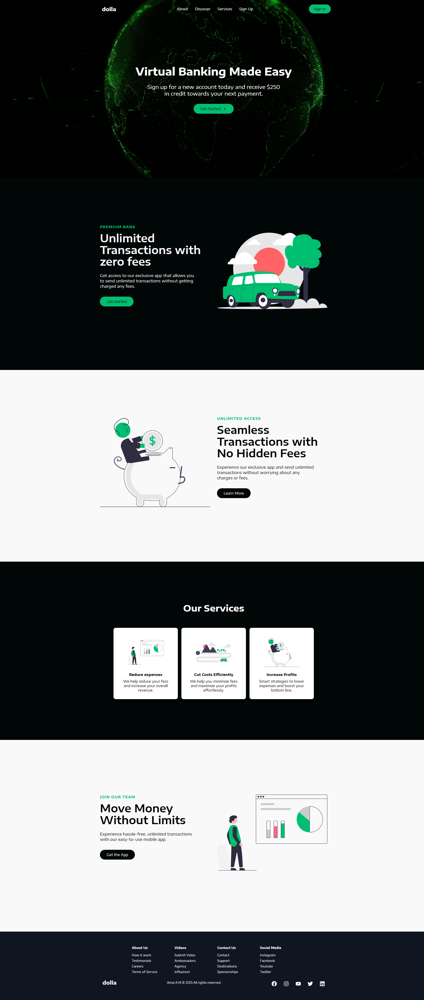

# React + Vite + Styled Components

A minimal React setup using Vite, **Styled Components**, and **React Smooth Scroll**. The project is fully responsive and uses **React Hooks** and **React Router** for navigation. Main sections are built as reusable components for easy customization.

## Features

- Fast React setup with Vite
- Styled Components for modular CSS
- Smooth scrolling between sections
- Responsive design for all devices
- Reusable, customizable components
- React Router for page navigation

## Screenshot



## Getting Started

### Install dependencies:
```bash
npm install
```

### Run the project:
```bash
npm run dev
```

